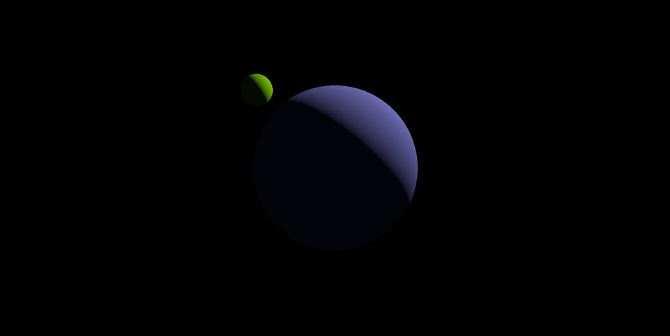

# Vulkan/Slang Renderer

This started out as an implementation of the standard [Vulkan Tutorial](https://docs.vulkan.org/tutorial/latest/00_Introduction.html).
It's become an experiment in integrating [Slang](https://shader-slang.org/) and the [Slang compile-time reflection API](https://docs.shader-slang.org/en/latest/external/slang/docs/user-guide/09-reflection.html).

The idea is to provide generated type-safe CPU bindings for an arbitrary slang shader, so you could have a workflow where both languages are hot reloaded and typechecked against each other. For now, I'm generating Rust (without hot reload), and many resource types aren't supported. In the future I'm hoping to target other languages as well. The renderer also has some other quality-of-life features like hot reloading shaders, and in-shader printf debugging.




## setup

For now, only linux and windows are supported.

When cloning this repo, use `git clone --recursive` to pick up the slang submodule.

You'll need the following dependencies installed:
- rust/cargo
- just
- direnv
- clang
- cmake

Then run:

``` sh
direnv allow # allow loading env vars
just build-slang # build slang from source (this will take a while)
just dev # run the default triangle example
```

